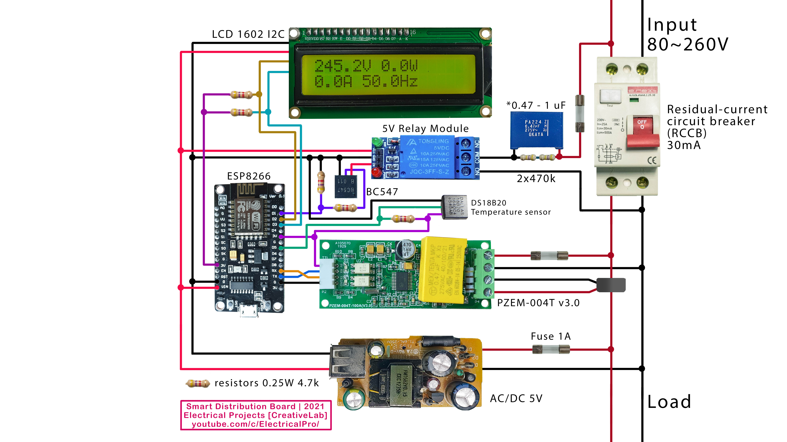

# This is Smart Distribution Board based on ESP8266

Watch how it works https://youtu.be/YGajnfcQebY

Read this if you have any problems: https://github.com/electrical-pro/SmartBoard/issues/1

[](http://www.youtube.com/watch?v=YGajnfcQebY "Video Title")

This is the final curcuit:


# This is components you need for the project: 

PZEM-004T: https://s.click.aliexpress.com/e/_9hYStD

ESP8266: https://s.click.aliexpress.com/e/_97j7kp

Resistors: https://s.click.aliexpress.com/e/_9AslPB

Electrolytic Capacitor: https://s.click.aliexpress.com/e/_A2atvx

PCB 6X8: https://s.click.aliexpress.com/e/_d7XpQnS

Pin Header: https://s.click.aliexpress.com/e/_AUvLzT

Female PCB Header: https://s.click.aliexpress.com/e/_AClQip

5V relay module: https://s.click.aliexpress.com/e/_AAXY9i

1602 I2C Display: https://s.click.aliexpress.com/e/_AF3L2o


# Compilation
Use core 2.7.4 for this project (Tested with this version)

upd: 08/12/2021 made some changes, tested with 3.0.2 (works)

please download the necessary libraries:
https://github.com/electrical-pro/SmartBoard/blob/main/libraries.zip
copy them from the archive to:
C:\Users<USERNAME>\Documents\Arduino\libraries

P.S. I modified the LiquidCrystal_I2C library, I removed Wire.begin(5, 14);

# Uploading files from data folder
The project uses SPIFFS to store files on ESP8266, upload them to the ESP8266 (read about SPIFFS if you dont know what that is.)

If you don't see this option install the plugin from here:
https://github.com/esp8266/arduino-esp8266fs-plugin

# Connecting to router
After flashing connect to "PowerControlESP | Offline" pass is "PowerControlPass" then go to 192.168.4.1 (WI-Fi manager) and connect to your Wi-Fi router.


Power server is at 192.168.x.x:8089 (port is 8089)

# Very unusual authorization that I implemented
If it says "The file exists, but you are not authorized!" - is a simple safety feature that I implemented,
so in order to access files you need to go to a secret URL first http://192.168.x.x:8089/me (you can program another one)
When you go to http://192.168.x.x:8089/me it puts a cookie in your browser and you become an authorized user

to make it work right set it to false in the sketch
```cpp
// set it to false, and then get auth cookie by going to 192.168.x.x:8089/me
bool PublicAccess = true;  // authorization 
```
If it is true it only allows you to go to http://192.168.x.x:8089

if it is false nothing is allowed unless you go to http://192.168.x.x:8089/me first

# Serial
Note that I use Serial for PZEM004Tv30 module
```cpp
PZEM004Tv30 pzem(&Serial);
```
Other information goes to Serial1 not Serial (so you will not see things in serial monitor)
 ```cpp 
Serial1.begin(115200);
 ``` 
# Good Luck
If you still have a problem read this: https://github.com/electrical-pro/SmartBoard/issues/1
Or open a new issue 
